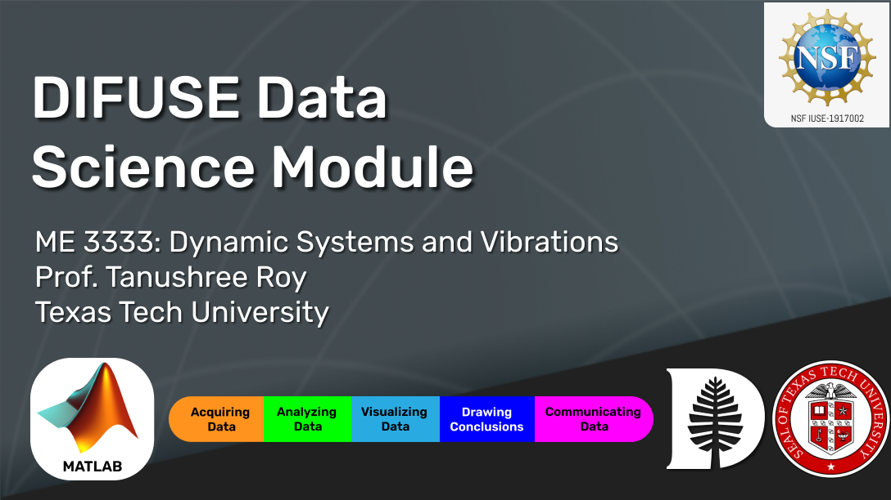

# System Modeling DIFUSE Module 

## Contributors: Logan Sankey ('20), Philip Mulford ('GR), Tanushree Roy (Professor of Mechanical Engineering), Laura Ray (DIFUSE PI, Professor of Engineering), Taylor Hickey ('23, Project Manager)

This module was developed through the DIFUSE project at Dartmouth College and funded by the National Science Foundation award IUSE-1917002.

|| <a rel="license" href="http://creativecommons.org/licenses/by-sa/4.0/"> </a>This work is licensed under a <a rel="license" href="http://creativecommons.org/licenses/by-sa/4.0/">Creative Commons Attribution-ShareAlike 4.0 International License</a>. |
|---------|----------|

## Module Objective 
Students should learn how to obtain system parameters from data, evaluate the linearity of a system, investigate sources of uncertainty that arise when using real-world data, and reflect on data aggregation. 

## Student Learning Objectives
1. Collect data from videos.
2. Analyze data they collected to obtain system parameters.
3. Aggregate class data to create a larger data set.
4. Draw conclusions about the system based on the parameters.
5. Reflect on the sources of variability in system and process. 

## Module Description
This module has 2 components: The individual data collection and analysis, and then drawing conclusions based on the aggregated class data. 
- Students will complete parts 1 and 2 individually and upload their results to a linked google form. 
- Students will complete parts 3 and 4 after the class data has been uploaded. 
- Students will submit their answers to all the numbered questions in a report on Canvas or a Canvas equivalent. 

The objective of this assignment is to derive parameters of a system from data and investigate the sources of uncertainty that arise when we take this approach. We will also learn how to identify nonlinearity in a system and reflect on the implications of doing system analysis with data

### Data
Data will be collected by students from the videos provided in the module. Expected data files are in .txt 

### Platform
This module uses MATLAB for analysis as well as Google Forms/Sheets to collect student responses.

## Schedule and Links

Use this page to get an idea of the timeline of the module, what components are involved, and what documents are related to each component. This is the schedule intended for module deployment by the DIFUSE team, though instructors are welcome to modify the timeline to fit their course environment.

### Assignment Document is linked [here](completed_module/components/Assignment.docx)
| Date     | In Class/Out of Class               | Assignment Description                           | Assignment Files (Linked to Repository Contents) |
|----------|--------------------------------------------|-------------------------------------------------|--------------------------------------------------|
| Part 1 | Out of Class | Data Collection and MATLAB | [Link to Footage for Data Collection](completed_module/data/Cart%20Footage/) |
| Part 2 | Out of Class | Individual Analysis | In Assignment Document |
| Part 3 | In Class  | Class Analysis | [System Identification Exercise](completed_module/components/System%20Identification%20Exercise.docx) |
| Part 4 | Out of Class | Reflection Questions | In Assignment Document |

## Course Information
This course was developed for a mechanical engineering course, <a href="https://catalog.ttu.edu/content.php?filter%5B27%5D=ME&filter%5B29%5D=3333&filter%5Bkeyword%5D=&filter%5B32%5D=1&filter%5Bcpage%5D=1&cur_cat_oid=19&expand=&navoid=1850&search_database=Filter#acalog_template_course_filter">Dynamic Systems and Vibrations</a>, at Texas Tech University which explores the modeling and analysis of dynamic systems, equilibrium, stability and linear systems theory, as well as the introduction to mechanical vibrations. Because this is an intermediate engineering course, students completing this module should have experience with system modeling, finding the time constant and motor gain of a system, plus a general understanding of MATLAB.

---

|| <a rel="license" href="http://creativecommons.org/licenses/by-sa/4.0/"> </a>This work is licensed under a <a rel="license" href="http://creativecommons.org/licenses/by-sa/4.0/">Creative Commons Attribution-ShareAlike 4.0 International License</a>. |
|---------|----------|

For instructors and interested parties, the history of this repository (with detailed commits), can be found [here](https://github.com/difuse-dartmouth/engineering-analyze-first-order-systems/commits/main/).
